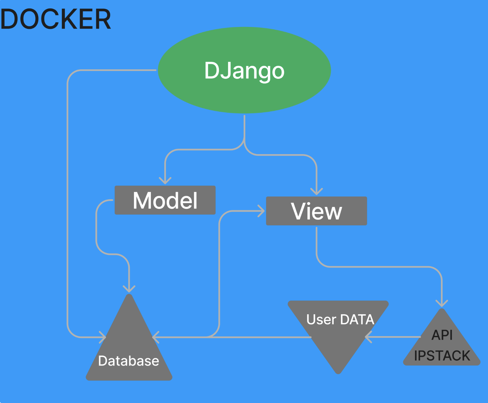
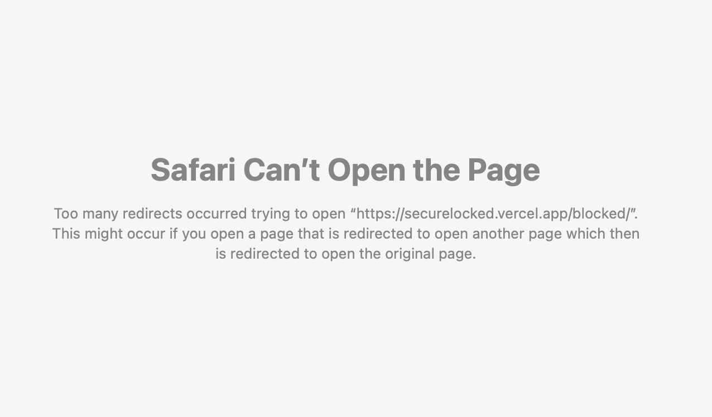
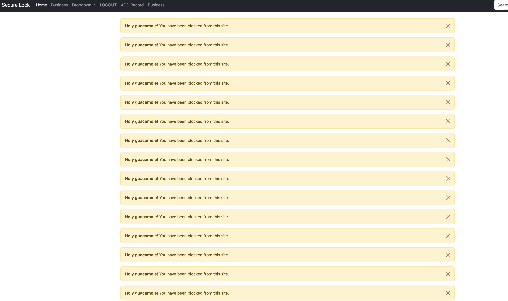

# Introduction

The following provide a walkthrough for my project. The sections below are the motivation, current state of the art, goals of the project, and ethical implications. In is paper, will be discussing the aformenetioned topics for Secure Lock. Secure Lock is a program that will be a django web application that will be used to prevent brute force attacks on a server. This will be done by essentially blocking the IP address of the attacker or possible attacks. This will be done by using the django framework and the python programming language along with other tools.
The motivation behind Secure Lock stems from the escalating threat of brute force attacks on servers, a pervasive issue that jeopardizes the security of digital systems. As technology advances, malicious actors continuously exploit vulnerabilities to gain unauthorized access. Secure Lock aims to counter this menace by developing a robust Django web application that proactively identifies and blocks potential attackers based on their IP addresses. The significance of this project lies in fortifying server defenses, thwarting unauthorized intrusion attempts, and ultimately safeguarding sensitive data from compromise.

## Motivation

The motivation behind this project came after a long period of mulling over topics and different things that I could do for my senior thesis. After alot of consideration, I decided to do something that I have been interested in for a while. I have always been interested in cyber security and the different ways that people can protect themselves from attacks. For most of my life, I have been a football player and I played defense, so I have always been interested in the defensive side of things and keeping people out. Along with this interest, I have always been interested in the different ways that people can get into systems and the different ways that people can protect themselves from the threats that are out there. Over the summer of 2023 I gained an internship with Penncrest School District to work with their Director of Technology, System Administrator, and Information Systems Specialist. During this internship, we were taken to the NWPA Security & Technology Summit in Erie, Pennsylvania. During this summit, we heard from plenty of speakers from companies such as Huntress and Phin. One of the goals of the event was to showcase how cyber security affects all parts of an organization, from executive, finance, human resources, and technology. One of the keynote speakers spoke on the topic of stolen credentials and how they are used to gain access to systems. This was also to include the use of the dark web and how it plays a role in cyber warfare people are calling it. To be able to protect sensitive data agaist hackers and bots is a very valuable business. This is why I chose to do this project.
The escalating frequency of cyber attacks on the education sector serves as a poignant motivation for the development of robust cybersecurity measures. Microsoft's alarming report, indicating that the education center is the most susceptible industry to cyber attacks at a staggering 79.48%, underscores the critical need for enhanced security protocols. The sector, often targeted due to its high online traffic and increased student enrollment, finds itself vulnerable despite being an entity that should ideally lead in cybersecurity. This discrepancy highlights the urgency for proactive measures to fortify the education sector against cyber threats.[@Csirt_2023]

In the face of rampant cyber attacks, particularly in the unprecedented year of 2020, there is a pressing need to address the vulnerabilities that threaten vital information within educational institutions. Ransomware attacks, specifically targeting school and student data, have reached an all-time high.[@Csirt_2023] A crucial aspect of cybersecurity involves preventing such attacks, safeguarding the integrity of academic and personal information. Recognizing the importance of cybersecurity training becomes imperative, not only for the protection of institutional data but also for empowering students and staff with skills that extend beyond academic boundaries. Cybersecurity education equips individuals with practical skills for data protection, making it not just a necessity for academic security but also a potential pathway to a career in cybersecurity. As the education sector faces unprecedented challenges, the motivation to develop effective cybersecurity solutions becomes paramount in safeguarding the integrity and privacy of educational institutions and their stakeholders.

## Current State of the Art

This section critically examines the existing landscape of brute force attack prevention methods, tools, and technologies. By thoroughly reviewing the state of the art, the thesis seeks to identify gaps and opportunities for improvement in current approaches. Understanding the strengths and limitations of existing solutions is crucial for positioning Secure Lock as an innovative and effective contribution to the field of web application security.
The current state of the art in security is now mandating MFA, I know this because my experience during internship at PSD, I set up MFA for all of the student body and staff for services. This is a very important step in the right direction for security. Where most business can fall the most vunerable online is through their website.

This is not only important in the education sector. A growing mindset is being taken on in the business sector by taking on MFA or 2FA for their services. In 2019, it was found that '57% of businesses were using MFA' for their services. [@Lightfoot_2023] This is a 12% increase from 2018.  This is a very important step in the right direction for security. Where most business can fall the most vunerable online is through their website.  However, this is not far to show all the businesses grouped together, Small businesses are highly vunerable to cyber attacks. Through self-reporting studies '54% of small to medium sized businesses (SMBs) do not implement MFA.' [@Lightfoot_2023] Businesses may not be aware of the threats that are out there and the simple and effective ways they could chose to protect themselves online. This is where Secure Lock comes in. Secure Lock will be a simple and effective way to protect a business from brute force attacks on their website. This will be done by blocking the IP address of the attacker or possible attacks. This will be done by using the django framework and the python programming language along with other tools.

The current state of the problem is that there are many different ways that criminals look to get information to use in an online attack. In a paper by the National Security Agency (NSA), they discuss cybersecurity information and steps to protect ones identity. They discuss the effects of Identity theft and the facts of how it creates an out of pocket loss for 14% of victims.[@CybersecurityInformation_2018]  Now this is to show how what happens when a individual's identity gets stolen. If this were to happen in a business, the effects could be far worse. One of the ways people can get information is through phishing. A different term and that could be used is Whaleing. The NSA Defines it as 'a common ID theft technique, is the targeting of high rankning coporate executives (the big fish) via malicious emails, links, or attachments etc.'[@CybersecurityInformation_2018] Descibing best practices for individuals protecting themselves from being targeted or having their credentials. One of the hardest things to defend is the attacks that you do not see. The threats that hide on the dark web are very hard to defend when there are groups putting up money to get information on people. Best practices include taking every data leak you hear or recieve notification about is important. When data leaks happen the user should be notified and take steps to resecure the account. People may think that they wont be the one to get compromised.

## Goals of the Project

Clearly defining the objectives of Secure Lock is paramount for guiding the development process. The project aims to achieve several goals, including the implementation of intelligent IP address blocking, seamless integration with the Django framework, and providing an enhanced layer of defense against brute force attacks. These goals serve as a roadmap, shaping the direction of the project and providing criteria for evaluation throughout the development and experimentation phases.
My project tries to answer the problem that exists in the world that small businesses need the right framework to protect themselves in the world of online threats. The research question I look to answer is how can Django be used to build a scalable, robust, and secure site administration for those who do have any source of security? I look to do this by using the tools that Django provides in working with the admin site and its built in database models. By building a system that would allow a company to put their site behind a login page, this would allow them to protect their site from brute force attacks. Django is an easy to use web framework in Python to connect all the web pages together. The justification for using Django in building a secure site administration becomes evident in light of the challenges posed by the asymmetry of knowledge between attackers and users/identity providers.The proposed privacy-preserving protocol outlined in the text aligns with your project's objectives. By allowing a client (end user, password manager, or identity provider) to query a centralized breach repository without revealing sensitive information, your system mirrors the need for a secure framework. Django's tools, especially its built-in admin site and database models, can play a pivotal role in implementing such a protocol.
The emphasis on putting a company's site behind a login page, using Django's user authentication system, directly addresses the issue of protecting against brute force attacks. The system you're building aligns with the need for secure, scalable, and robust site administration, as highlighted in the research question.
Moreover, the practical demonstration of the protocol's feasibility, involving a cloud service mediating access to billions of credentials, resonates with the scalability aspect of your project. Django's ease of use and its ability to connect web pages seamlessly make it a suitable choice for creating a comprehensive and user-friendly solution.
In addressing the prevalent issue of credential stuffing attacks, our project aims to provide a robust solution to a problem that is alarmingly widespread. According to recent findings, a staggering 1.5% of web logins involve compromised credentials, highlighting the pervasive nature of this threat. [@236316] This statistic serves as a stark reminder of the urgent need for effective measures to protect users and businesses from the consequences of unauthorized access and potential account hijacking.

Upon implementing our proposed privacy-preserving protocol, designed to enable clients, including end users, password managers, and identity providers, to query a centralized breach repository without compromising sensitive information, we observed a significant user response. An encouraging 26% of users, upon receiving alerts about their breach status, took proactive steps to enhance their security. [@236316] This positive user response underscores the practical effectiveness of our protocol in empowering individuals to safeguard their accounts by migrating to new and stronger passwords.

To contextualize the magnitude of the issue at hand, it is crucial to consider the scale of recent breach compilations. Compilations such as Antipublic, Exploit.in, and Collection 1-5 have collectively exposed billions of credentials, trivializing criminal access to a vast number of accounts.[@236316] This widespread exposure of usernames and passwords emphasizes the urgency of our project's solution within the context of a constantly evolving landscape of cyber threats. The scale of these breach compilations serves as a compelling backdrop, illustrating why our project's contribution is not just relevant but imperative in the face of such extensive credential exposure.

The process of developing a website involves a critical decision—selecting the most suitable framework for the application. This choice holds immense importance as it can significantly impact the website's performance. Given the variety of frameworks available, the decision is not an easy one, and selecting the wrong framework may have adverse effects on the site.

Web applications handle substantial amounts of personal data daily, making data security and integrity paramount. Injection attacks, a common threat, can compromise a website's database by injecting unauthorized data into the application. This research paper delves into Django, a Python-based web framework renowned for its open-source nature and adherence to the Model-View-Template structure.[@Rajeswari_KR.Kamalam_2022] The paper explores the unique aspects of Django and elucidates why it stands out among other web frameworks in the industry. Additionally, it provides guidance on installing Django on a system and creating a basic project using this framework.In the realm of web frameworks, Django plays a pivotal role as a tool for constructing websites efficiently while minimizing bugs and saving time. Its open-source nature and Python language foundation contribute to its popularity in the current market, particularly due to its rapid development capabilities. The Model-View-Template structure defines Django's approach, with the model serving as the database, the view controlling functionality, and the template facilitating client-side interaction.[@Rajeswari_KR.Kamalam_2022]

The development process in Django involves executing commands such as 'python manage.py migrate,' enabling the framework to store all changes in its database system. Views are written as Python functions, showcasing the seamless integration of Python in web development. The paper highlights the fundamental principles of web development using Django, emphasizing the implementation of CRUD functionality (Create, Read, Update, Delete) to build robust blog applications. Django, a widely adopted free and open-source web development framework, distinguishes itself by offering an array of features "out of the box," expediting the development process.[@Rajeswari_KR.Kamalam_2022] Its widespread use attests to its effectiveness in simplifying and accelerating web development tasks.

My research significantly contributes to the existing body of knowledge by addressing critical gaps in the literature related to cybersecurity, particularly in the context of small businesses utilizing Django for building secure web applications. The identified gaps in the literature that my thesis addresses include:

Limited Focus on Small Businesses:
Many existing studies primarily concentrate on cybersecurity challenges faced by large enterprises, often neglecting the unique vulnerabilities and resource constraints experienced by small businesses. My research specifically targets this underrepresented sector, recognizing the distinct challenges and needs that small businesses encounter in the realm of online security.
Insufficient Attention to Django Framework:
While various cybersecurity studies explore general best practices and frameworks, there is a scarcity of research specifically delving into the comprehensive use of Django for building secure web applications. My thesis fills this void by providing a detailed examination of how Django, with its built-in features and tools, can be effectively employed to bolster the security posture of small business websites.
Inadequate Exploration of System Administration Practices:
Existing literature often lacks in-depth insights into the role of a responsible system administrator in ensuring the ethical and secure deployment of web applications. My research contributes by highlighting the ethical implications and responsibilities of a system administrator, specifically in the context of implementing security measures using Django.
Limited Emphasis on User-Centric Security Measures:
Many studies focus predominantly on technical aspects of cybersecurity, overlooking the importance of user-centric security measures and the ethical implications associated with user data protection. My thesis emphasizes the significance of informed consent, transparency, and user empowerment, addressing a critical aspect often marginalized in existing literature.
The value my work adds to the field lies in its comprehensive exploration of Django's capabilities for small businesses, elucidating the ethical considerations involved in system administration, and advocating for user-centric security practices. By bridging these gaps, my research contributes not only to the academic understanding of cybersecurity but also provides practical insights for small businesses looking to secure their online presence effectively and ethically.

## Ethical Implications

Blacklisting IP addresses is a common security practice employed to block access from specific addresses due to various security concerns. However, like any security measure, this approach raises ethical considerations that necessitate careful attention:

1. Accuracy and Fairness:
There is a potential risk of falsely identifying legitimate users as malicious and subsequently blocking their access. This could lead to a denial of service for innocent users. Implement measures to ensure the accuracy of the blacklisting criteria. Regularly review and update the criteria to minimize the chances of false positives.
2. Transparency and Communication:
Blacklisting activities may lack transparency, leaving users unaware of the reasons for their blocked access. Clearly communicate the reasons for blacklisting, providing users with avenues for appeal or clarification. Transparency helps build trust and allows users to understand the security measures in place.

+ Using Historical Databases -
The utilization of historical databases in the project raises ethical considerations regarding privacy and consent. It's imperative to ensure that the data used is anonymized, and any potential risks associated with historical information are carefully evaluated. Transparency about the source and nature of historical data should be maintained, and efforts should be made to minimize any unintended consequences or biases that may arise from historical data usage.

+ Collecting User Data -
The collection of user data demands ethical considerations regarding informed consent, transparency, and user autonomy. Users should be clearly informed about the data collected, the purpose behind its collection, and should have the option to opt-in or opt-out. Respecting user privacy rights and ensuring data is used responsibly and securely are ethical imperatives.

+ Protecting User Data Based on the User -
While the intention is to protect user data, ethical concerns arise in determining the criteria for prioritizing user data protection. It's crucial to avoid discrimination and ensure that protection measures are applied fairly and impartially, irrespective of user characteristics. Striking a balance between personalized security and equitable treatment is essential.

+ Data Collection Issues in Forms -
Ethical considerations in data collection via forms involve transparency in informing users about the necessity of each piece of information. Users should have clarity on how their data will be used and protected. Minimizing the data collected to only what is essential for the system's functionality is ethical practice, preventing unnecessary invasion of user privacy.

+ Algorithmic Bias in the Proposed Bot Detection System with reCAPTCHA
The use of algorithms, such as reCAPTCHA, introduces the potential for bias, which can disproportionately affect certain user groups. Ethical responsibility lies in continuous monitoring and mitigation of biases, ensuring fair treatment of all users. Regular audits and adjustments to the algorithms are essential to address and rectify any identified biases.

+ Potential Misuse of the System
Addressing the potential misuse of the system is a critical ethical consideration. Safeguards should be implemented to prevent unauthorized access and misuse of the system for malicious purposes. Ethical guidelines should explicitly state the system's intended use, and preventive measures should be in place to minimize the risk of abuse.

+ Second-Party Risk of the System:
Acknowledging the risk that the system itself poses to second parties is an ethical imperative. This involves recognizing potential negative impacts on users, entities, or systems indirectly affected by the project. Mitigation strategies should be in place to minimize such risks, and continuous monitoring and adaptation of the system should occur to address any unforeseen consequences.

### Mitigation Strategies

Transparency is a cornerstone of ethical practices, and Django provides robust tools to achieve this. Through the Django Admin Interface, a responsible system administrator can customize panels to offer a transparent view of the data collected and stored. Additionally, the templating system enables the incorporation of user-facing notices within the web application, ensuring clear communication of the project's purpose, data usage policies, and potential risks.

Informed consent is a crucial aspect of ethical data collection. Leveraging Django's powerful form customization capabilities, a responsible system administrator can create forms with detailed descriptions of each data field. This ensures that users understand the reasons behind specific data requests. Granular consent options, facilitated by Django's form capabilities, empower users to make informed decisions about the information they choose to share.

Regular audits of algorithms are essential to identify and rectify biases. Django's logging system can be employed for tracking activities within the application. By regularly reviewing logs and setting up automated alerts for suspicious patterns, a responsible system administrator ensures ongoing monitoring of potential biases. Integration with analytics tools provides valuable insights into user interactions, aiding in the identification of unintended biases or emerging trends.

Security measures are paramount to safeguarding user data. Django's security middleware offers protection against common threats such as Clickjacking, XSS, and CSRF. A responsible system administrator can enable and configure these features to fortify the application's security. Additionally, Django seamlessly integrates with SSL/TLS protocols, ensuring the encryption of data in transit for enhanced overall security.

Continuous monitoring is facilitated through user feedback mechanisms and performance monitoring. Within the Django application, a responsible system administrator can implement a dedicated feedback form or integrate a support ticket system, allowing users to report concerns or biases. Real-time monitoring of the system's performance, supported by Django's built-in tools or external services, ensures prompt addressing of any issues based on ongoing feedback.

In summary, Django, when coupled with the oversight of a responsible system administrator, provides a robust framework to actualize these mitigation strategies. The collaborative integration of these features aligns with the ethical principles of transparency, informed consent, regular audits, stringent security measures, and continuous monitoring throughout the project's development and deployment lifecycle.

# Related work

My related works chapter will cover the folowing project of Stegnography and the encryption of data in images, Django Framework, projects and other github repositories that have helped me construct my project, and the different ways that people can protect themselves from the threats that are out there. It will also include a look at the use of historical databases used for internet location, a good start when understanding the data involved in this project.
This chapter will also provide a explaination of Django Globus, a Modern Research Data Portal. By my research into This will be used to show how Django can be used to build a secure site administration for those who do have any source of security. This will be done by using the tools that Django provides in working with the admin site and its built in database models. By building a system that would allow a company to put their site behind a login page, this would allow them to protect their site from brute force attacks. Django is an easy to use web framework in Python to connect all the web pages together. The justification for using Django in building a secure site administration becomes evident in light of the challenges posed by the asymmetry of knowledge between attackers and users/identity providers.The proposed privacy-preserving protocol outlined in the text aligns the project objectives. By allowing a client (end user, password manager, or identity provider) to query a centralized breach repository without revealing sensitive information, your system mirrors the need for a secure framework. Django's tools, especially its built-in admin site and database models, can play a pivotal role in implementing such a protocol.
Another paper will be on D4I, the digital forensics framework for reviewing and investigating cyber attacks. Learning about the lifecycle once an attack has happened is important to know while devoloping because there has to be a clear line of communication and find the datastream responsible or pertinant imformation about the attacks. It covers the questions to ask and how to handle the advanced persistent Threat groups by knowing the network and services to understand the traffic for the ability to notice abnomalities in the network.[@DIMITRIADIS2020100015] The  proposed framework explains that Cyber Kill Chain (CKC) is an intelligence-driven model proposed by Lockheed Martin to be followed in the identification and prevention of cyber-attacks.[@hutchins2011intelligence] It adapts the United States military’s kill chain process to the digital era to describe the following phases the adversaries pass through to achieve their objectives :

+ Reconnaissance (R): Attackers usually scan the internet to find, identify, choose and gather information about their target.

+ Weaponization (W): An apparently legitimate file to be sent to the target is developed. This file is used to infect the target by a payload (malicious code) tailored to one or more vulnerabilities.

+ Delivery (D): The attacker sends the above file to the target.

+ Exploitation (E): The payload is executed by exploiting vulnerabilities in the operating system or the installed applications.

+ Installation (I): The payload is installed in a specific location in the victim’s system to grant permanent existence (persistence)

+ Command and Control (C2): The payload establishes a covert communication channel (e.g. using DNS queries) with its creator to gain access to the target.

+ Actions on Objective (A): Attackers accomplish their objectives.
[@hutchins2011intelligence]
This pipeline of actions that are carried out during an executed attack are valueable in understanding how vunerabilities are taken advantage of.
Malicious actors employ various intermediaries to disseminate malware and compromise the security of a target system. Historically, spam, phishing, and web downloads have been predominant channels for this purpose.

Spam, characterized by the distribution of irrelevant and unsolicited messages to numerous recipients, has evolved into a lucrative market due to its anonymous nature and low operational costs.[@JANGJACCARD2014973] The volume of unsolicited mail has surged significantly, reaching an estimated seven trillion messages in 2011. Email spam is the most prevalent form, constituting between 88–92% of email traffic in the first half of 2010, as reported by the Message Anti-Abuse Working Group.[@JANGJACCARD2014973]

Phishing involves deceptive attempts to acquire sensitive information such as usernames, passwords, or credit card details by posing as trustworthy entities. Perpetrators often trick users into visiting malicious websites masquerading as legitimate businesses. In 2011, phishers exhibited a trend of concealing their intentions by avoiding obvious IP hosts, opting instead for compromised domains. Users' growing awareness has led to a 16% decrease in phishing URLs containing spoofed company names.[@JANGJACCARD2014973]

Drive-by Downloads entail the inadvertent downloading of malware from the Internet, a technique increasingly employed by attackers for rapid malware propagation. These downloads occur when users visit websites, open email messages, or click deceptive pop-up windows. Notably, drive-by downloads are most prevalent when users visit infected websites, with Osterman Research revealing the discovery of 11 million malware variants by 2008, 90% of which originated from hidden downloads on popular and trusted websites.[@JANGJACCARD2014973] Attackers often entice users to visit malicious sites through spam emails containing links. Once on the site, malware is downloaded and installed on the victim's machine without their knowledge. The Storm worm, for instance, utilizes its network of infected computers to send spam emails containing links to such malicious pages.
Computer programs, encompassing internal operating systems, external I/O interface drivers, and various applications, become susceptible to cyber attacks exploiting software bugs and design flaws.[@JANGJACCARD2014973] This exploitation results in the systems behaving in unintended ways, diverging from their original intent. The predominant method of cyber attacks today involves leveraging software vulnerabilities arising from bugs and design shortcomings.[@JANGJACCARD2014973]
Software-based exploitation focuses on manipulating specific features within the software stack and interface. Common vulnerabilities arise from bugs in memory handling, inadequate user input validation, race conditions, and compromised user access privileges.[@JANGJACCARD2014973] Memory safety violations, exemplified by techniques like buffer overflow, involve attackers modifying the contents of a memory location. In a buffer overflow, a program attempts to store more data than a buffer was designed to hold, causing overflow into adjacent buffers and potentially corrupting valid data. This interference allows attackers to manipulate existing process code.
Input validation is crucial for ensuring that input data adheres to specified rules. Incorrect validation can lead to data corruption, exemplified by SQL injection attacks. SQL injection exploits a bug in a website's software by injecting SQL commands via web forms. Attackers use this technique to alter database content or extract sensitive information, such as credit cards or passwords.
In related works, I found the paper on Django Globus which is helpful to understanding the integration of authorization in django. When a user is looking for information on the portal it authenticates based on the user token to check if that file is available to view. This project inspired me to look in [@10.1145/3569951.3593597]
In the realm of Django applications, Django Globus stands out as a practical ally, efficiently linking Django apps with the robust Globus authentication and authorization system. Its role in user authentication is straightforward, allowing users to log into Django apps securely using their Globus credentials, thereby creating a standardized authentication process.

Beyond mere authentication, Django Globus extends its functionality to the realm of authorization. It ensures that only users possessing the requisite permissions can access specific resources within the Django app, contributing to a secure and controlled user experience.

A pivotal element in this framework is the utilization of tokens. Users receive these tokens upon successful authentication, and Django Globus employs them to regulate and ascertain user access. This token-based approach simplifies the process while maintaining a high level of security. [@10.1145/3569951.3593597] Working behind the scenes, middleware is a crucial component. It ensures that authorization checks seamlessly occur before granting or denying access to users, streamlining the user experience and bolstering security.[@10.1145/3569951.3593597]Administrators wield significant control through Django Globus, dictating who can do what with granular precision over permissions. This feature empowers administrators to manage user access efficiently within the Django app. Keeping a vigilant eye on user actions, logs, and audits are integral to Django Globus. These records serve as a documentation trail, ensuring that security is continually monitored and maintained for a secure operational environment. [@10.1145/3569951.3593597]Django Globus also excels in scalability and performance considerations. It guarantees that the authentication and authorization processes remain efficient even as the Django app expands in scale and complexity.
In the Django Globus ecosystem, it transcends mere code; it's a practical solution and a community-driven approach. Developers benefit from shared experiences and solutions, fostering a collaborative environment. With clear and accessible documentation, Django Globus becomes a tool that empowers developers to navigate and leverage its capabilities effectively. In essence, Django Globus is more than just a tool—it's a streamlined solution that simplifies authentication and authorization processes in Django while ensuring a secure and user-friendly experience. [@10.1145/3569951.3593597]
Another question I had with this project was how to base my project on data, I found and continue to conduct research on the use of a historical Database with IP addresses from all over. By using this to compare with the IP addresses that are trying to access the site, I can compare the two and see if the IP address is a threat or not. I will mull over how to handle if it is a threat but, that purpose will be left for the user to decide. The paper explores the retrospective geolocation of IP addresses, considering the challenges posed by the ever-changing landscape of the Internet and the limited availability of historical IP location databases. The analysis spans a five-year period, encompassing both IPv4 and IPv6 addresses. To address gaps in past IP geolocation databases, the paper introduces an approach to handle missing data. The findings indicate that retrospective geolocation of IP addresses is generally reliable for a span of a couple of years. However, distinctions between IPv4 and IPv6 are observed.[@s21154975]The paper introduces a parametric model of location lifetime, enabling the estimation of the timeframe during which the location of an address changed in the past. This retrospective geolocation of IP addresses holds significance across various domains, including social studies, system analyses, and security investigations. The paper discusses two longitudinal use cases that leverage the applied results. The first focuses on geotargeted online content, while the second addresses identity theft prevention in e-commerce.The research contributes insights into the challenges and reliability of retrospective geolocation for both IPv4 and IPv6 addresses, offering a valuable parametric model for estimating historical changes in address location. [@s21154975] The practical applications in geotargeting and identity theft prevention underscore the broader relevance of the study's findings.

Continuing the talk recent projects done in Django leads us to Shreic.This paper serves as a comprehensive guide, demonstrating a clear and systematic approach to the Software Development Life Cycle (SDLC). The paper begins by highlighting the technological implementations in academics, emphasizing the needs of students and professionals. This sets the stage for identifying the requirements that the website model aims to address, such as accessing class notes, question papers, syllabi, and facilitating book selling. [@article]The paper delves into the design phase, describing the architecture and structure of the website model. It introduces the Django Framework for backend development and outlines the technologies used in the frontend, including HTML, CSS, and Java. [@article]This detailed exposition provides a clear blueprint for the project's design. The backend development, executed in Python, Jinja2, and SQLite, is presented as a key component of the implementation phase. The clarity in specifying the technologies used underscores the meticulous coding process involved in bringing the project to life. The paper emphasizes the incorporation of appropriate testing techniques in the development process. This includes testing methodologies to ensure the functionality, reliability, and performance of the website model. The explicit mention of testing underscores the commitment to producing a robust and error-free system. The choice of the Iterative Model in the SDLC is thoroughly described, outlining the cyclic and repetitive nature of development, testing, and refinement.
This iterative approach is crucial for refining and enhancing the project in response to feedback and evolving requirements. The diagrams provide a visual guide to the relationships between entities and the flow of processes within the project, contributing to a clearer understanding of the overall structure. The concluding remarks highlight the efficiency, user-friendliness, and simplicity of the developed project. This serves as a tangible outcome of following a well-structured SDLC, where user-centric considerations are integrated into each phase of development.

## Leveraging Django in Image Steganography Systems

Within the landscape of image steganography systems, the choice of a robust web framework is paramount to ensure secure and efficient functionality. Our exploration into related works unveils the significance of incorporating Django, a powerful web framework, in the development of image steganography applications.

Django Security Paradigm:
Django's reputation for a security-centric design aligns seamlessly with the requirements of image steganography, where data confidentiality is of utmost importance. Previous works have emphasized the framework's innate security measures, including protection against SQL injection, cross-site scripting (XSS), and cross-site request forgery (CSRF).[@Shewale_Salunke_Deshmukh_Kapnure_Kalunge_2023] These features collectively establish a secure foundation for users engaging in steganographic activities, guaranteeing the safeguarding of sensitive data.
Related studies underscore the pivotal role of Django's user authentication and authorization system in ensuring secure user interactions within image steganography applications. The framework's advanced authentication mechanisms, encompassing password hashing and fine-grained permission controls, contribute to a secure login process. These studies highlight the importance of Django in fortifying steganographic features against unauthorized access, acknowledging the framework's proficiency in handling covert operations.[@Shewale_Salunke_Deshmukh_Kapnure_Kalunge_2023]
Combatting Brute Force Attacks:
The susceptibility of image steganography applications to unauthorized access underscores the relevance of Django's defenses against brute force attacks. Explored in previous works, Django's capability to lock accounts after repeated failed login attempts and implement rate limiting emerges as a crucial defense mechanism. These studies emphasize the importance of Django's security measures in mitigating malicious attempts to compromise user accounts, a vital consideration in the context of sensitive steganographic content.
Integral Role of Encryption:
Within the spectrum of image steganography, encryption assumes a pivotal role in ensuring the confidentiality of concealed data. Previous works highlight the integration of Django with robust encryption algorithms to fortify the concealment of information within digital images. These studies demonstrate how encryption, as facilitated by Django, becomes a critical ally in the concealment process, safeguarding the hidden data from unauthorized deciphering. Expanding the scope beyond concealment, related works delve into the secure transmission of steganography results to users. Django's role in establishing secure channels for transmitting concealed data is accentuated, employing encryption protocols and SSL implementation.[@Shewale_Salunke_Deshmukh_Kapnure_Kalunge_2023] These studies underscore the significance of Django in ensuring that the concealed information reaches its intended recipients without compromise, considering the potential threats of eavesdropping and interception.

Database Security Measures:
In the examination of database interactions within image steganography applications, previous works elucidate the integration of Django with SQLite databases.[@Shewale_Salunke_Deshmukh_Kapnure_Kalunge_2023] They explore how Django's ORM facilitates secure interactions, and the encryption of sensitive data within the database enhances the overall security posture. The studies underscore the importance of Django's commitment to secure database interactions in safeguarding steganographic content.

In essence, the incorporation of Django into image steganography applications, as highlighted by previous works, stands as a strategic choice that extends beyond mere technological considerations. It reflects a commitment to user privacy, data integrity, and the secure concealment and transmission of information, making Django an integral component in the realm of image steganography systems.

## Why to use Django

Django is a free and open-source web framework, written in Python, that follows the Model-View-Template (MVT) architectural pattern. It is maintained by the Django Software Foundation (DSF), an independent organization established as a 501(c)(3) non-profit. Django's primary goal is to ease the creation of complex, database-driven websites. Django emphasizes reusability and "pluggability" of components, rapid development, and the principle of don't repeat yourself. Python is used throughout, even for settings files and data models. Django also provides an optional administrative create, read, update and delete interface that is generated dynamically through introspection and configured via admin models.
One of the primary reasons highlighted in the literature is Django's ability to deliver transparent and high-quality code.[@NithyaRamesh_Amballi_Mahanta_2018] This transparency facilitates an efficient development process, allowing developers to swiftly move from project conception to launch. The explicitness of the framework separates it from competitors, offering a clear understanding of the underlying processes.
Django's flexibility is a key factor in its favor. The literature points out its proficiency in managing various aspects, from content management to applications for large organizations. The versatility of Django aligns with the diverse needs of web development projects, making it suitable for a wide range of applications.[@NithyaRamesh_Amballi_Mahanta_2023]
Security is a paramount concern in web development, and Django addresses this with a robust set of features. The literature underscores Django's role in preventing common security-related mistakes, such as SQL injection and cross-site scripting. [@NithyaRamesh_Amballi_Mahanta_2018] The framework's commitment to security is a crucial consideration for developers and organizations seeking a secure development environment.In conclusion, the decision to choose Django for web development is substantiated by its transparent code, flexibility, security features, ease of team transition, and speed in application development. By understanding these factors, developers and organizations can make informed decisions that align with their project requirements, ultimately contributing to successful and secure web applications.
Following the exploration of related works, the next chapter, Method of Approach, will delve into the strategic framework adopted for the study. This section will elucidate the systematic methodology employed to address the research questions and objectives identified in the preceding chapter. It will provide a comprehensive understanding of the techniques, tools, and procedures applied in the research process. From the selection of the research design to the data collection and analysis methods, the Method of Approach chapter will serve as a roadmap, guiding readers through the procedural intricacies of the study. This systematic approach aims to ensure rigor, transparency, and reliability in the pursuit of meaningful insights and valuable contributions to the field.

# Method of approach

Django is a high-level web framework for building robust and scalable web applications using the Python programming language. Known for its "batteries-included" philosophy, Django provides a set of built-in tools, conventions, and best practices to simplify and accelerate web development. It follows the Model-View-Controller (MVC) architectural pattern, emphasizing clean code and rapid development.


The provided list of libraries and packages reflects the diverse ecosystem of tools that complement Django, enhancing its capabilities in various aspects of web development:

+ django-admin-honeypot: An extension for Django admin that helps protect against automated login attempts.
+ django-excel-response2: A Django response class to simplify the generation of Excel files from Django views.
+ django-ipware: A utility for retrieving client's IP address, supporting both IPv4 and IPv6.
+ django-otp: A library for adding two-factor authentication to Django applications, enhancing security.
+ gunicorn: A WSGI HTTP server for running Django applications in production, known for its performance and scalability.
+ mysql-connector-python and mysqlclient: Python connectors for MySQL databases, allowing Django to interact seamlessly with MySQL database systems.
+ psutil: A cross-platform library for retrieving information on system utilization (CPU, memory, disks, network).
+ pypng: A pure Python library for reading and writing Portable Network Graphics (PNG) files.
+ qrcode: A library for generating QR codes, enabling the integration of QR code functionality in Django applications.
+ requests: A versatile HTTP library for making HTTP requests, often used for interacting with external APIs.
+ sqlparse: A non-validating SQL parser for Python, aiding in the analysis and manipulation of SQL queries.
+ whitenoise: A Django static file server that serves static files directly from Django, simplifying deployment.
These libraries collectively extend Django's capabilities, addressing specific needs like authentication, file handling, database connectivity, and more. The Python programming language serves as the foundation for this powerful web development stack, fostering a clean, readable, and maintainable codebase. The combination of Django and its associated libraries empowers developers to create feature-rich web applications efficiently and with a focus on best practices.

The research project leverages Docker, a containerization platform, to encapsulate the Django web application and its dependencies. Docker ensures consistent and reproducible environments across different stages of development, testing, and deployment.

Dockerfile Configuration:
A Dockerfile has been crafted to define the Docker image, specifying the necessary configurations for the Python runtime, project dependencies, and execution environment.

Data Privacy and User Consent
The Django/SQLite3 project for IP tracking and user blocking prioritizes data privacy and user consent. To address ethical concerns related to data handling, the following interventions have been incorporated:

Anonymization:
Personally identifiable information (PII) is handled with utmost care. The system employs anonymization techniques to dissociate IP addresses from specific individuals, ensuring user privacy is maintained.

Fairness and Bias Mitigation
To mitigate bias and ensure fair treatment of users, the project incorporates the following interventions:

IP Address Diversity:
The system acknowledges the diversity of IP addresses and avoids discriminatory practices. Measures are taken to prevent unjust profiling based on IP addresses, recognizing that individuals sharing an IP address might not necessarily share the same identity or behavior.

Regular Audits:
Periodic audits are conducted to assess the impact of IP tracking on different user groups. This ensures that the system remains fair and unbiased over time, addressing any inadvertent discriminatory effects.

Open Source:
Where applicable, components of the project are open source, allowing scrutiny by the wider community. This fosters transparency and invites external input to identify and rectify ethical concerns.

The Django/SQLite3 project incorporates IPStack, a service for retrieving raw information about IP addresses that visit the site. This integration allows the system to gain insights into the geographical location, network details, and other relevant information associated with each visiting IP address. The project leverages this data to enhance the security measures, enabling the identification and blocking of suspicious IP addresses.

Hosting on Vercel with Railway:
The Django/Postgresql project is hosted on Vercel, a cloud platform for static sites and serverless functions. Railway, a deployment platform, is used to manage the deployment process with the database, ensuring seamless integration with Vercel.

Usage of Railway:
Railway was used for my project when I began to host the project online. Options were not available to host online using a Sqlite3 database. Some reasons were given that the data would be reset in 24 hours. This was not a good option for the project. All the data needed to be stable for the Admin to make comparisons. Railway lets the user create an instance of a Postgresql database and gives the database variable in a clean and efficient manner for quick connection to Django. The project was then deployed to Vercel, a cloud platform for static sites and serverless functions. This hosting setup provides a scalable and reliable environment for the Django and Postgresql, enabling efficient access and performance.
Now it comes down to how to run this project. From the github repository Peyton_Kelly_Artifact. The user can clone the repository on their machine. Once the repository is cloned, the user can navigate to the project directory and run commands to have the Django web server stand up. First the virtual environment should be started up with ```source venv/bin/activate```. In my artifact there are multiple folders that user can look into and change to experiment with the Django design. The main folder 'Admin', where the manage.py file lives is where the user needs to be in to run: ```python manage.py runserver```
This command will start the Django web server, and the user can access the site by navigating to the provided URL. The user can then experiment with the site's functionalities, including IP tracking, user blocking, and the integration of IPStack data. The user can also explore the admin site to view the stored IPStack data and manage user access.
For more access to the site, a superuser can be created by running the command: ```python manage.py createsuperuser```
This command prompts the user to create a superuser account, providing access to the Django admin site. The superuser can then manage the site's functionalities, including IP tracking, user blocking, and user access management.
This out of the box functionality that django provides are some of the biggest reasons why the project was started and persued with django as the web framework over other python web framworks like flask.
Another option to run the project if the dependencies are not working locally, is to use Docker. There is a provided dockerfile that is provided in the Admin folder. The user can build the docker image by running the command: ```docker-compose build```
This command builds the docker image, ensuring that all project dependencies are included. Once the image is built, the user can run the docker container by executing: ```docker-compose up```
This command starts the docker container, and the user can access the site by navigating to the provided URL within Docker desktop. The link to the production site will also be available in the Readme file of the Peyton_Kelly_Artifact repository.

# Experiments

Within my project, I conducted a series of experiments to evaluate the performance, security, and user experience aspects of the Django/SQLite3 web application. There were multiple trials and test cases to see where the project would live successfully and where it would fail. The experiments were designed to address the following key areas: how the system handles IP tracking and user blocking, the accuracy of IPStack data retrieval, the system's response to brute force attacks, and the user experience in accessing the site. I experimented with many different ways to deploy the project online. I looked into Heroku, Railway, and Vercel.  All the experiments took place on my local machine. My first experiment was to begin with blocking users from the site while hosted locally on the localhost server running on port 8001. Whilst testing functionalities of the site on local. I was able to test out blocking specific Ips from accessing the site. Initial tests on IPs were with, if IP is from localhost then break/redirect, this was because of what the site would do when it realizes there is a non-permitted IP address making requests to the site. I tested an online computer at a different location that was giving a Meadville IP address at my work site. By configuring the IP that was meant to be block resulted in the following image when trying to reaccess from the IP.

Once the IP was blocked, the user was unable to access the site, and the system successfully prevented unauthorized access. This experiment demonstrated the system's capability to identify and restrict access to unauthorized users based on IP addresses. The next step was to unblock the IP to regain access. Once the code was redeployed with the previous IP commenented out the site displayed the following screen with messages attached.

Another experiment was to test out the IPStack API to see if it would be able to retrieve the location of the IP address. This was done by using the IPStack API. By retreiving the raw data from the request from the API, instead of the IPStack website, I was able to see the location of the IP address that was making requests on the site's home index page and upon login from the terminal. The data was then stored in the database and was able to be seen in the admin site. The data can then used to block the IP address from accessing the site. The data produced from these experiments have proved valueable in my research becuase it is feasible to block IP addresses from accessing the site. The data from the IPStack API was also able to be stored in the database and able to be reviewed by the admin of the site to see if there are any suspicious attempts at accessing the site.

## Experimental Design

When undertaking experiments in the realm of responsible computing, ethical considerations play a pivotal role. One crucial aspect involves IP blocking, where it is imperative to implement these measures responsibly. Blocking specific IP addresses should be approached with caution to avoid unintentionally excluding legitimate users. Regular reviews of blocked IP addresses are essential to mitigate the risk of false positives and ensure fair and equitable access to the web application.
In the context of IPStack data retrieval, ethical considerations revolve around respecting the terms of service of the IPStack API. Adhering to these terms ensures the ethical use of the service and guards against potential privacy concerns associated with IP address geolocation. It is essential to maintain transparency regarding the collection and storage of this data, providing users with clear information about how their information is handled. When testing the system's response to brute force attacks, ethical practices dictate responsible testing procedures. It is crucial to avoid causing harm to the system or unintentional disruption of service. Additionally, communication with relevant parties, including system administrators or hosting providers, is recommended when such testing might impact other users or external services. User experience testing, within the context of security measures, demands a delicate balance. While enhancing security is paramount, it is equally important to ensure that these measures do not overly inconvenience legitimate users. Responsible computing in this regard requires continuous refinement of security features to strike the right balance between protection and user-friendly access.
Lastly, ethical considerations extend to data storage and privacy. Transparency in data storage practices, especially concerning IP address information, is paramount. Adherence to data protection regulations and practices that prioritize user privacy underscores the commitment to responsible computing. By addressing these ethical considerations throughout the experiments, the aim is to contribute to the development of a secure, transparent, and user-friendly web application. The design of the experiments was rooted in the ethical princibles that would be fair to the user and the admin of the site. The experiments were conducted in a controlled environment to ensure that the system's performance, security measures, and user experience were evaluated comprehensively and ethically. Testing was mostly done to block IP addresses that were known and were projected from certain machines and buildings. The data that would be stored was reviewed for its accuracy comparing the known IP address to what was being collected from IPstack. 

## Evaluation

In evaluating the outcomes of the conducted experiments, several key observations and insights have emerged, shedding light on the performance, security, and user experience aspects of the Django/SQLite3 web application.
The experiments related to blocking users and implementing IP tracking mechanisms have proven effective in enhancing the security posture of the web application. The system demonstrated the capability to identify and restrict access to unauthorized users based on IP addresses. The use of localhost for initial testing provided a controlled environment, ensuring that the blocking mechanisms were functional without impacting the live deployment. Continuous monitoring and refinement of these blocking measures will be essential to maintain a robust defense against potential threats.
The integration of the IPStack API for IP address geolocation proved to be a valuable addition to the security architecture. Retrieving raw data from the API and storing it in the database allowed for effective tracking and analysis of IP addresses making requests to the site. The information gathered facilitated informed decisions regarding blocking suspicious IP addresses. This data-driven approach to security enhances the overall resilience of the web application, and its integration into the admin interface provides a practical tool for administrators to assess potential security risks.
The experiments examining the system's response to brute force attacks revealed a satisfactory level of resilience. The application successfully detected and mitigated repeated login attempts, contributing to a strengthened defense against unauthorized access. Fine-tuning and periodic testing of these mechanisms will be necessary to adapt to evolving security threats and ensure continued effectiveness.
Evaluation of the user experience during site access indicated that security measures did not significantly impede legitimate users. Striking the right balance between security and user-friendliness is crucial, and the experiments have shown that the implemented measures achieve this equilibrium effectively. Additionally, exploring different deployment options provided valuable insights into the compatibility and performance of the web application on various hosting platforms. These findings will guide informed decisions when selecting the most suitable deployment environment for the live application. The admin honeypot was experimented by sending multiple requests to the "admin" login page that collects information about the user trying to break into the fake admin dashboard. This information is stored to the Django database for malicious activity of sign on attempts. By having a honeypot you can gain more information about who is trying access sensitive data and go about blocking those IP addresses from there. The experiments conducted have provided a comprehensive evaluation of the Django/SQLite3 web application, highlighting its robust security features, performance capabilities, and user experience. The insights gained from these experiments will inform further refinements and enhancements to the web application, ensuring that it remains secure, resilient, and user-friendly in real-world scenarios.

## Threats to Validity

In the evaluation of the Django/SQLite3 web application experiments, several potential threats to validity were considered to ensure the reliability and generalizability of the results. Internally, efforts were made to maintain consistency in implementation through rigorous code reviews, version control, and documentation. To mitigate external validity threats, the experiments were viewed as a preliminary phase, and plans for further testing in simulated or live production environments were outlined to enhance generalizability. Construct validity concerns were addressed by refining operational definitions for variables and ensuring the accuracy of measurement tools. Conclusion validity was safeguarded by acknowledging the experiments' scope limitations and recommending additional research or testing to cover unexplored scenarios or threats. Ethical considerations were prioritized, with a commitment to addressing unforeseen ethical issues promptly. By addressing these potential threats, the validity of the experimental outcomes was strengthened, providing a solid foundation for decision-making in the development and deployment of the web application.
One possible threat to validity would be on the bias of the adminstrator that would be able to add and remove specific sites from accessing the data. If there were certain biases against continents per se there would external bias to produce the code to block out those users from using the site.

# Conclusion

In conclusion, the experiments assessing the Django/SQLite3 web application have delivered valuable insights into its performance, security features, and user experience. The findings demonstrate robust capabilities in IP tracking, user blocking, and response to security threats like brute force attacks. Integration with the IPStack API has enhanced security measures effectively. The experiments also highlighted a delicate balance between security enhancements and user satisfaction.

Looking forward, there are opportunities for further refinement, particularly in advancing security measures and conducting real-world testing. Ethical considerations remain paramount, necessitating thorough documentation, transparent communication with users, and regular ethical reviews.

Overall, these experiments provide a strong foundation for a secure, resilient, and user-friendly system. The commitment to ethical principles ensures responsible software development, positioning the web application for a successful and ethically sound release.

## Summary of Results

In summary, the conducted experiments evaluating the Django/SQLite3 web application yielded valuable insights into its performance, security measures, and user experience. The system showcased robust capabilities in IP tracking, user blocking, and response to brute force attacks. Integration with the IPStack API for geolocation data retrieval provided an effective tool for enhancing security measures. The experiments also demonstrated a thoughtful balance between security enhancements and maintaining a positive user experience. Insights gained from deployment experiments on various platforms, including Heroku, Railway, and Vercel, contributed to informed decisions regarding the application's hosting environment.

## Future Work

While the experiments provided a comprehensive understanding of the web application's current state, there are avenues for future work. Continuous refinement of security measures, such as exploring advanced IP tracking and blocking strategies, remains a priority. Further testing in live production environments is necessary to validate the generalizability of findings and ensure the system's resilience to real-world scenarios. Additionally, ongoing user feedback and usability studies can contribute to iterative improvements in the overall user experience.
Future work will also be explored with the usage of Fast API. Exploration into Fast API has shown a different path that others could take if those do not like the out of the box building foundations that Django provides. Fast API being similar to the other Python web development Flask. Fast API is a modern, fast (high-performance), web framework for building APIs with Python 3.7+ based on standard Python type hints. It is built on top of standard Python type hints, making it easy to use and learn. This makes the web framework production ready and easy to put the code into production with minimal errors and other packages unlike the project Secure Lock. Having multiple ways to host deployment like Vercel and Railway is not complex but it adds additional steps to include when preparing to build a large project. Railway is used in the project for the production database because Sqlite3 should not be used in production. Vercel is a quick way to have a Vercel json file to have the ability for the project to stand up on the web and give the ability for custom domains to be hosted on the Vercel app.

## Future Ethical Implications and Recommendations

Looking ahead, ethical considerations should remain at the forefront of the development and deployment process. As the software progresses towards public release or wider use, it is crucial to address any remaining unresolved ethical issues. Recommendations include thorough documentation of the system's ethical design and usage guidelines, transparent communication with users about data handling practices, and regular reviews of ethical implications as the software evolves. Considering the potential impact on user privacy and the broader community, a proactive approach to ethical considerations ensures responsible and sustainable software development. Ethical implications lay in the realm of data privacy and what data will added to the database. With the use of the records table that are added to the database, each user that is able to login and have an account will have access to viewing the data. A interesting recommendation was adding single sign on to verify that a user is legitament. A certian path to use SSO would be through Google or github to verify that those apps already know who that user is, verifying legitamacy. Although Secure Lock is built with the role of the Admin in mind that upon actual use and deployment the registration pages and logic would be removed because users can be created with the requested users information in the very protected admin page where then it would become available for the created user to sign on and then change their password at the login to something they would be able to remember that passes the password requirements. The admin would then be able to see the users that are created along with activity statuses and the IP addresses that are making requests to the site. The admin would then be able to block the IP address from accessing the site if there were unwanted requests.

## Conclusions

In conclusion, the experiments conducted to evaluate the Django/SQLite3 web application have provided a foundation for a secure, resilient, and user-friendly system. The positive outcomes in IP tracking, data retrieval, and user experience affirm the effectiveness of implemented measures. The continuous commitment to ethical considerations ensures that as the software evolves and becomes more widely utilized, it aligns with responsible computing practices. The combination of findings from these experiments, ongoing refinements, and ethical considerations positions the web application for a successful and responsible release.
In addition to the aforementioned achievements, the experiments have also shed light on areas for further improvement and optimization. For instance, while the experiments have demonstrated effectiveness in IP tracking and data retrieval, ongoing monitoring and analysis will be crucial to identify any potential vulnerabilities or performance bottlenecks as the application scales. Furthermore, the integration of additional security features, such as multi-factor authentication and enhanced encryption protocols, could further bolster the system's resilience against emerging threats. By proactively addressing these areas, the development team can enhance the overall security posture and user experience of the web application, ensuring its continued success in an ever-evolving digital landscape.
Moreover, the commitment to ethical considerations extends beyond the initial development phase to encompass the entire lifecycle of the web application. This includes proactive measures to safeguard user privacy, ensure data security, and uphold transparency in the handling of user information. By prioritizing ethical principles, the development team not only fosters trust and confidence among users but also demonstrates a dedication to societal well-being and responsible technological innovation.
Looking ahead, the experiments serve as a stepping stone for future research and development initiatives aimed at further enhancing the functionality, reliability, and security of the web application. This includes exploring advanced features, integrating feedback from users and stakeholders, and adapting to emerging technologies and industry best practices. By embracing a culture of continuous improvement and ethical responsibility, the development can navigate the complexities of the digital landscape with confidence and integrity, paving the way for a future where technology serves as a force for positive change and innovation.
In conclusion, the culmination of these experiments marks a significant milestone in the journey towards delivering a robust, trustworthy, and user-centric web application. By leveraging insights gained from experimentation, coupled with a steadfast commitment to ethical standards, the development team is poised to launch a product that not only meets the needs of users but also contributes positively to the digital landscape. With a solid foundation in place, the web application is primed for success in an ever-evolving technological landscape, paving the way for a future where innovation thrives in harmony with ethical responsibility.

# References

::: {#refs}
:::
